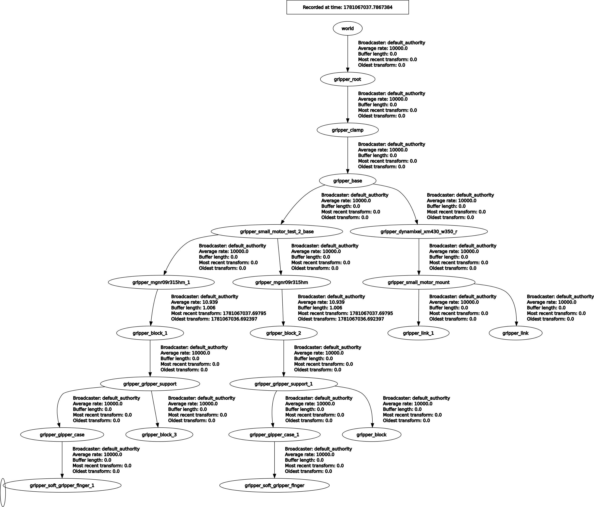

# Gripper Two Fingers

This package provides a ROS 2 **action server** node for direct single-servo control of a Two finger gripper using **DynamixelSDK Protocol 2.0**.

This node follows the guidelines of [Gripper-level ROS2 interface](../docs/gripper/ros2-interface.md) and exposes:

- `/gripper_command` using `control_msgs/action/GripperCommand`
- articulation publication for `robot_state_publisher` by publishing the mechanism `joint_states` needed to keep the TF tree connected.

This builds on top of [Gripper Servo Dynamixel](../gripper_servo_dynamixel/README.md)

## What This Package Does

- Wraps the low-level Dynamixel driver from `gripper_servo_dynamixel`
- Exposes the standard gripper-level command action
- Maps servo feedback into the two slider joints used by the current URDF model
- Keeps the simulated and physical gripper articulation aligned through the gripper config

For the current two-finger node, the preferred articulation model is now:

- one **left finger** displacement parameter block
- one **right finger** displacement parameter block
- `gripper_two_fingers` publishing the two slider-joint states
- `robot_state_publisher` handling the moving TF tree from those joint states

Those joint positions are derived from the configured servo open/close range and published on `/joint_states`.


## Quick start

The launch ownership is intentionally split:

- `gripper_ros/gripper_soft_two_fingers.launch.py`: independent hardware/gripper launch
- `gripper_ros/gripper_sim.launch.py`: visualization-only launch for `robot_state_publisher` and RViz

Run the hardware/gripper node:

```bash
source install/setup.bash
ros2 launch gripper_ros gripper_soft_two_fingers.launch.py
```

Run the visualization alongside it:

```bash
source install/setup.bash
ros2 launch gripper_ros gripper_sim.launch.py model:=two-finger-gripper-standalone
```

The sim launch depends on the live `/joint_states` published by `gripper_two_fingers_node`.

### Open the gripper:

```bash
source install/setup.bash
ros2 action send_goal /gripper_command control_msgs/action/GripperCommand "{command: {position: 0.09, max_effort: 0.0}}"
```

### Close the gripper:

```bash
source install/setup.bash
ros2 action send_goal /gripper_command control_msgs/action/GripperCommand "{command: {position: 0.0, max_effort: 0.0}}"
```

Close the gripper with an effort limit:

```bash
source install/setup.bash
ros2 action send_goal /gripper_command control_msgs/action/GripperCommand "{command: {position: 0.0, max_effort: 5.0}}"
```

`GripperCommand.command.position` is the jaw opening in meters. The current two-finger config maps `0.09` m to the configured servo open position and `0.0` m to the configured servo close position.

## Gripper-level two-finger mapping

At the gripper layer, the current preferred configuration is no longer a flat list of many mechanism joints.
Instead, use a per-finger mapping:

```yaml
gripper_left_finger:
  joint_name: gripper_planar_4
  joint_open_position: -0.045
  joint_close_position: 0.0

gripper_right_finger:
  joint_name: gripper_planar_5
  joint_open_position: -0.045
  joint_close_position: 0.0
```

Interpretation:

- the measured motor position is converted into command units
- that scalar is mapped into left/right slider travel using the configured servo open/close range
- the resulting slider `joint_states` are consumed by `robot_state_publisher`

The current URDF-backed public articulation joints are:

- `gripper_planar_4`
- `gripper_planar_5`

If simulated motion is inverted relative to hardware, update only:

- `gripper_left_finger.joint_open_position`
- `gripper_left_finger.joint_close_position`
- `gripper_right_finger.joint_open_position`
- `gripper_right_finger.joint_close_position`

in the runtime YAML instead of patching the Python node.

For a single coupled servo, the intended physical model is usually:

- `finger_displacement ~= total_gap_change / 2`

because each finger moves approximately half the distance relative to the centerline.


### Two layers of parameter configuration

There are *two* parameter YAML layers:

1. **Servo config** (in `gripper_ros`)
    - File: `gripper_ros/config/servos/dynamixel.yaml`
    - Contains the “site specific” choices: which motor model preset, which serial port, which ID, and your `open_position` / `close_position`.
    - The current motor YAML uses a wildcard `/**` parameter root so both the low-level and gripper-level nodes can reuse the same motor defaults.

2. **Gripper config** (in `gripper_ros`)
    - File: `gripper_ros/config/grippers/soft_two_finger_dynamixel.yaml`
    - Contains the “gripper specific” details: joint names, open/close positions, and torque-related parameters.

## Gripper config

For common gripper-level parameters, see [Gripper Parameter reference](../docs/gripper/parameters.md).

### Joint mapping parameters

Unique parameters for this two-finger node include following which are used to map the physical servo position into the simulated (rviz) slider joints:

- `gripper_left_finger.joint_name`
- `gripper_left_finger.joint_open_position`
- `gripper_left_finger.joint_close_position`

- `gripper_right_finger.joint_name`
- `gripper_right_finger.joint_open_position`
- `gripper_right_finger.joint_close_position`

The current configuration maps servo feedback into the urdf/robot_state_publisher slider travel directly:

- joint_open_position maps to `-0.045`
- joint_close_position maps to `0.0`

If simulated motion is reversed relative to hardware, adjust only the `joint_open_position` and `joint_close_position` values in the gripper YAML.

### Servo parameter overrides

Overriding servo parameters from the gripper config:

- `XM430.control_torque`: default torque request used in torque mode when the goal torque is `0.0`
- `XM430.use_torque_mode`: default torque-mode behavior when the goal does not explicitly enable it
- `XM430.default_torque`: used when goal `torque` is `0.0`
- `XM430.safety_torque_limit`: stop threshold used while running in position mode
- `XM430.use_torque_mode`: default action mode when the goal does not explicitly request one

## TF Tree

